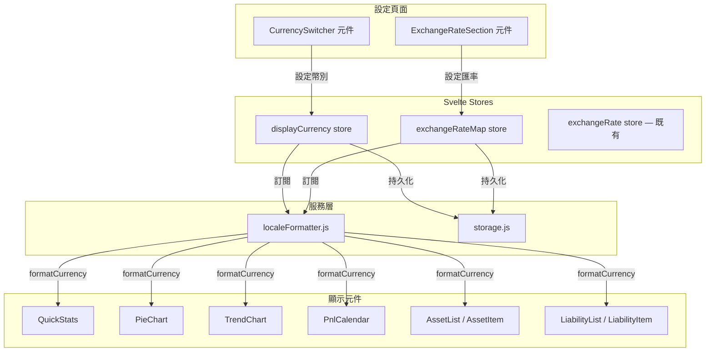

# 設計文件：貨幣切換功能（Currency Switcher）

## 概述

本功能在 Net Worth Tracker 設定頁面新增貨幣切換機制，讓使用者可將所有金額顯示從預設的 TWD（新台幣）切換為 USD、CNY、JPY 或 KRW。設計核心原則為**僅影響顯示層**——底層資料儲存與計算邏輯維持以 TWD 為基準不變，換算僅在 `localeFormatter.js` 的 `formatCurrency()` 函式中進行。

### 設計決策

1. **顯示層換算策略**：不修改任何計算函式（`calculateTotals`、`calculateGrowthRates` 等），而是在格式化輸出時統一除以匯率。這確保了資料完整性，且修改範圍最小。
2. **匯率對照表擴展**：將現有的單一 `exchangeRate`（USD/TWD）store 擴展為多幣別匯率對照表 `exchangeRateMap` store，儲存 TWD 對各目標貨幣的匯率。
3. **新增 `displayCurrency` store**：獨立管理顯示貨幣設定，與匯率設定分離，職責清晰。
4. **向後相容**：保留現有 `nwt_exchange_rate` localStorage key 供 USD/TWD 匯率使用，新增 `nwt_display_currency` 和 `nwt_exchange_rate_map` key。

## 架構



### 資料流

1. 使用者在設定頁面選擇顯示貨幣 → `displayCurrency` store 更新 → localStorage 持久化
2. 使用者編輯匯率 → `exchangeRateMap` store 更新 → localStorage 持久化
3. `localeFormatter.js` 訂閱 `displayCurrency` 和 `exchangeRateMap`，當任一變更時：
   - 若 `displayCurrency === 'TWD'`：`formatCurrency(amount)` 行為不變
   - 若 `displayCurrency !== 'TWD'`：`formatCurrency(amount)` 先將 TWD 金額除以對應匯率，再以目標貨幣格式化
4. 所有使用 `formatCurrency()` 的元件自動反映新貨幣（Svelte 響應式更新）

## 元件與介面

### 1. `displayCurrency` Store（新增）

**檔案**：`src/lib/stores/displayCurrency.js`

```javascript
// localStorage key: nwt_display_currency
// 預設值: 'TWD'
// 支援的貨幣: ['TWD', 'USD', 'CNY', 'JPY', 'KRW']

interface DisplayCurrencyStore {
  subscribe: (callback: (value: string) => void) => () => void;
  set: (currency: string) => void;  // 設定並持久化
}
```

- 啟動時從 `localStorage.getItem('nwt_display_currency')` 讀取，若無則預設 `'TWD'`
- `set()` 同時更新 store 值與 localStorage
- 提供 `SUPPORTED_CURRENCIES` 常數陣列：`['TWD', 'USD', 'CNY', 'JPY', 'KRW']`
- 提供 `CURRENCY_NAMES` 對照表：`{ TWD: '新台幣', USD: '美元', CNY: '人民幣', JPY: '日圓', KRW: '韓元' }`

### 2. `exchangeRateMap` Store（新增）

**檔案**：`src/lib/stores/exchangeRateMap.js`

```javascript
// localStorage key: nwt_exchange_rate_map
// 預設值: { USD: 31.5, CNY: 4.35, JPY: 0.21, KRW: 0.023 }
// TWD 匯率固定為 1，不儲存

interface ExchangeRateMapStore {
  subscribe: (callback: (value: Record<string, number>) => void) => () => void;
  setRate: (currency: string, rate: number) => void;  // 設定單一匯率並持久化
  setAll: (rates: Record<string, number>) => void;    // 批次設定並持久化
}
```

- 啟動時從 `localStorage.getItem('nwt_exchange_rate_map')` 讀取
- 若無資料，使用預設匯率值
- `setRate()` 更新單一幣別匯率，同時持久化整個 map
- TWD 匯率始終為 1，不可修改
- 同步更新既有 `exchangeRate` store（`exchangeRateMap.USD` → `exchangeRate`），確保向後相容

### 3. `localeFormatter.js` 修改

**修改重點**：`formatCurrency()` 函式加入顯示貨幣換算邏輯。

```javascript
// 新增訂閱
import { displayCurrency } from '$lib/stores/displayCurrency.js';
import { exchangeRateMap } from '$lib/stores/exchangeRateMap.js';

let currentDisplayCurrency = 'TWD';
let currentRateMap = { USD: 31.5, CNY: 4.35, JPY: 0.21, KRW: 0.023 };

displayCurrency.subscribe(v => { currentDisplayCurrency = v; });
exchangeRateMap.subscribe(v => { currentRateMap = v; });

// 各貨幣小數位設定
const CURRENCY_DECIMALS = {
  TWD: 0,
  USD: 2,
  CNY: 2,
  JPY: 0,
  KRW: 0,
};

/**
 * 格式化貨幣金額。
 * 若 displayCurrency 非 TWD，先將 TWD 金額除以匯率再格式化。
 *
 * @param {number} amount — TWD 金額
 * @param {string} [currency='TWD'] — 原始幣別（保留向後相容）
 * @returns {string} 格式化後的貨幣字串
 */
export function formatCurrency(amount, currency = 'TWD') {
  const target = currentDisplayCurrency;
  let displayAmount = amount;

  if (target !== 'TWD') {
    const rate = currentRateMap[target];
    if (rate && rate > 0) {
      displayAmount = amount / rate;
    }
  }

  const decimals = CURRENCY_DECIMALS[target] ?? 0;

  return new Intl.NumberFormat(currentLocale, {
    style: 'currency',
    currency: target,
    minimumFractionDigits: decimals,
    maximumFractionDigits: decimals,
  }).format(displayAmount);
}
```

**關鍵設計**：
- `formatCurrency()` 的第一個參數 `amount` 始終假設為 TWD 值（與現有行為一致）
- 換算公式：`displayAmount = twdAmount / rateMap[targetCurrency]`
- 例如：TWD 100,000 → USD = 100000 / 31.5 ≈ $3,174.60
- `formatCompact()` 函式（PieChart 中使用）也需同步修改，使用相同的換算邏輯

### 4. `CurrencySwitcher` 元件（新增）

**檔案**：`src/components/settings/CurrencySwitcher.svelte`

按鈕群組形式呈現五個貨幣選項，選中項以 accent 色高亮。

```svelte
<!-- 結構示意 -->
<section class="settings-section">
  <h2>{t('settings.displayCurrency')}</h2>
  <div class="currency-btn-group">
    {#each SUPPORTED_CURRENCIES as cur}
      <button
        class="currency-btn"
        class:active={$displayCurrency === cur}
        on:click={() => selectCurrency(cur)}
      >
        {cur} {CURRENCY_NAMES[cur]}
      </button>
    {/each}
  </div>
</section>
```

- 點擊按鈕時呼叫 `displayCurrency.set(cur)` 並顯示 Toast 通知
- 使用 `settings-section` 全域 CSS class 保持與其他設定區塊一致

### 5. `ExchangeRateSection` 元件修改

將現有的單一 USD/TWD 匯率輸入擴展為多幣別匯率編輯介面。

```svelte
<!-- 結構示意 -->
<section class="settings-section">
  <h2>{t('settings.exchangeRate')}</h2>
  {#each editableCurrencies as cur}
    <div class="rate-row">
      <label>1 {cur} =</label>
      <input type="number" bind:value={rateInputs[cur]} />
      <span>TWD</span>
    </div>
  {/each}
  <button on:click={handleSaveAll}>{t('common.save')}</button>
</section>
```

- `editableCurrencies` = `['USD', 'CNY', 'JPY', 'KRW']`（TWD 固定為 1，不可編輯）
- 儲存時驗證每個匯率值為有限正數
- 儲存成功後同步更新 `exchangeRateMap` store 和既有 `exchangeRate` store

### 6. `storage.js` 擴展

新增兩組讀寫函式：

```javascript
// 新增 localStorage keys
const KEYS = {
  // ...existing keys
  DISPLAY_CURRENCY: 'nwt_display_currency',
  EXCHANGE_RATE_MAP: 'nwt_exchange_rate_map',
};

export function saveDisplayCurrency(currency) { writeItem(KEYS.DISPLAY_CURRENCY, currency); }
export function loadDisplayCurrency() { return readItem(KEYS.DISPLAY_CURRENCY, 'TWD'); }

export function saveExchangeRateMap(rateMap) { writeItem(KEYS.EXCHANGE_RATE_MAP, rateMap); }
export function loadExchangeRateMap() {
  return readItem(KEYS.EXCHANGE_RATE_MAP, {
    USD: 31.5, CNY: 4.35, JPY: 0.21, KRW: 0.023
  });
}
```

### 7. i18n 翻譯擴展

在各語言 JSON 檔案中新增以下 key：

```json
{
  "settings": {
    "displayCurrency": "顯示貨幣",
    "displayCurrencyDesc": "切換所有金額的顯示幣別，底層資料不受影響",
    "rateMapTitle": "匯率設定",
    "rateMapDesc": "設定各貨幣對新台幣的匯率"
  },
  "currency": {
    "TWD": "新台幣",
    "USD": "美元",
    "CNY": "人民幣",
    "JPY": "日圓",
    "KRW": "韓元"
  },
  "toast": {
    "currencySwitched": "顯示貨幣已切換為 {currency}",
    "rateMapUpdated": "匯率已更新"
  },
  "validation": {
    "ratePositiveAll": "所有匯率必須為正數"
  }
}
```

### 8. 設定頁面整合

修改 `src/routes/settings/+page.svelte`，在 `ExchangeRateSection` 上方加入 `CurrencySwitcher` 元件：

```svelte
<div class="settings-col-left">
  <CurrencySwitcher />        <!-- 新增 -->
  <ExchangeRateSection />     <!-- 既有，修改為多幣別 -->
  <DataManagement />
  <GoogleIntegration />
</div>
```

## 資料模型

### localStorage 資料結構

| Key | 型別 | 預設值 | 說明 |
|-----|------|--------|------|
| `nwt_display_currency` | `string` | `'TWD'` | 當前顯示貨幣代碼 |
| `nwt_exchange_rate_map` | `object` | `{ USD: 31.5, CNY: 4.35, JPY: 0.21, KRW: 0.023 }` | TWD 對各貨幣匯率 |
| `nwt_exchange_rate` | `number` | `31.5` | USD/TWD 匯率（既有，保留向後相容） |

### 支援貨幣定義

| 貨幣代碼 | 中文名稱 | 預設匯率（1 外幣 = X TWD） | 小數位 |
|----------|----------|---------------------------|--------|
| TWD | 新台幣 | 1（固定） | 0 |
| USD | 美元 | 31.5 | 2 |
| CNY | 人民幣 | 4.35 | 2 |
| JPY | 日圓 | 0.21 | 0 |
| KRW | 韓元 | 0.023 | 0 |

### 換算公式

```
顯示金額 = TWD 金額 / exchangeRateMap[displayCurrency]
```

- 當 `displayCurrency === 'TWD'` 時，`rate = 1`，顯示金額 = TWD 金額（無換算）
- 例：淨資產 TWD 3,000,000 → USD = 3,000,000 / 31.5 ≈ $95,238.10


## 正確性屬性

*正確性屬性是一種在系統所有有效執行中都應成立的特徵或行為——本質上是對系統應做什麼的形式化陳述。屬性作為人類可讀規格與機器可驗證正確性保證之間的橋樑。*

### 屬性 1：貨幣設定持久化 Round-Trip

*對於任何*支援的貨幣代碼，將其設定為顯示貨幣後，從 localStorage 讀取應得到相同的貨幣代碼。同樣地，應用程式重新啟動時，store 應從 localStorage 還原先前的設定。

**驗證：需求 2.1, 2.2**

### 屬性 2：匯率對照表持久化 Round-Trip

*對於任何*有效的匯率對照表（所有值為有限正數），將其儲存至 localStorage 後再讀取，應得到等價的匯率對照表。

**驗證：需求 3.4**

### 屬性 3：貨幣換算正確性

*對於任何* TWD 金額和任何支援的顯示貨幣，`formatCurrency()` 輸出的數值部分應等於 `amount / exchangeRateMap[currency]`（在浮點精度範圍內）。當顯示貨幣為 TWD 時，輸出應與原始 TWD 格式化行為一致（即不進行任何換算）。

**驗證：需求 4.1, 4.2**

### 屬性 4：貨幣格式化正確性

*對於任何*金額，以 JPY 或 KRW 格式化時應產生零小數位的輸出，以 USD 或 CNY 格式化時應產生最多兩位小數的輸出。且格式化結果應包含對應貨幣的正確符號。

**驗證：需求 4.3, 4.4**

### 屬性 5：顯示層不影響底層資料

*對於任何*資產與負債資料集，無論顯示貨幣如何切換，localStorage 中的 `nwt_assets`、`nwt_liabilities`、`nwt_snapshots` 資料應保持不變。同時，`calculateTotals()` 和 `calculateGrowthRates()` 的輸出不受 `displayCurrency` 設定影響。

**驗證：需求 6.1, 6.2**

### 屬性 6：匯出匯入資料完整性

*對於任何*顯示貨幣設定，`exportData()` 輸出的 JSON 中所有金額應為原始 TWD 數值。同樣地，`importData()` 應以 TWD 為基準匯入資料，不受當前 `displayCurrency` 設定影響。

**驗證：需求 6.3, 6.4**

### 屬性 7：無效匯率拒絕

*對於任何*非有限正數的輸入值（包括負數、零、NaN、Infinity、非數字字串），匯率驗證函式應拒絕該值並回傳 false。

**驗證：需求 7.3**

## 錯誤處理

### 匯率驗證

| 錯誤情境 | 處理方式 |
|----------|----------|
| 使用者輸入非數字 | `parseFloat()` 回傳 NaN → `validateExchangeRate()` 回傳 false → 顯示錯誤訊息 |
| 使用者輸入負數或零 | `validateExchangeRate()` 回傳 false → 顯示錯誤訊息「匯率必須為正數」 |
| 使用者輸入 Infinity | `isFinite()` 檢查失敗 → 顯示錯誤訊息 |
| localStorage 中匯率資料損壞 | `readItem()` 的 try-catch 捕獲 JSON.parse 錯誤 → 回傳預設匯率 |
| localStorage 中貨幣代碼無效 | 檢查是否在 `SUPPORTED_CURRENCIES` 中 → 若無效則回退至 TWD |

### 邊界情況

| 情境 | 處理方式 |
|------|----------|
| 匯率為極小值（如 0.001） | 正常換算，可能產生極大的顯示金額 |
| 金額為 0 | 正常格式化為 0，不進行除法 |
| 金額為負數（淨資產為負） | 正常換算，保留負號 |
| 首次使用無 localStorage 資料 | 所有 store 使用預設值（TWD、預設匯率） |

## 測試策略

### 雙軌測試方法

本功能採用**單元測試 + 屬性測試**雙軌並行的測試策略：

- **單元測試**：驗證特定範例、邊界情況與錯誤條件
- **屬性測試**：使用 `fast-check` 驗證跨所有輸入的通用屬性

### 屬性測試配置

- 測試框架：Vitest + fast-check（專案已安裝）
- 每個屬性測試最少 100 次迭代
- 每個屬性測試以註解標記對應的設計文件屬性
- 標記格式：`Feature: currency-switcher, Property {number}: {property_text}`

### 測試檔案規劃

| 測試檔案 | 測試範圍 | 測試類型 |
|----------|----------|----------|
| `tests/displayCurrency.test.js` | displayCurrency store 持久化 round-trip | 屬性測試 + 單元測試 |
| `tests/exchangeRateMap.test.js` | exchangeRateMap store 持久化 round-trip | 屬性測試 + 單元測試 |
| `tests/localeFormatter.test.js` | 貨幣換算與格式化正確性 | 屬性測試 + 單元測試 |
| `tests/storage.test.js`（擴展） | 匯出匯入資料完整性 | 屬性測試 |
| `tests/calculator.test.js`（擴展） | 計算函式不受顯示貨幣影響 | 屬性測試 |

### 屬性測試與設計屬性對應

| 設計屬性 | 測試檔案 | fast-check Arbitrary |
|----------|----------|---------------------|
| 屬性 1：貨幣設定 Round-Trip | `displayCurrency.test.js` | `fc.constantFrom('TWD', 'USD', 'CNY', 'JPY', 'KRW')` |
| 屬性 2：匯率 Round-Trip | `exchangeRateMap.test.js` | `fc.record({ USD: rateArb, CNY: rateArb, JPY: rateArb, KRW: rateArb })` |
| 屬性 3：換算正確性 | `localeFormatter.test.js` | `fc.double({ min: -1e8, max: 1e8 })` × `fc.constantFrom(...)` |
| 屬性 4：格式化正確性 | `localeFormatter.test.js` | `fc.double({ min: 0, max: 1e8 })` × `fc.constantFrom(...)` |
| 屬性 5：資料不受影響 | `calculator.test.js` | 既有 `assetArb` / `liabilityArb` |
| 屬性 6：匯出匯入完整性 | `storage.test.js` | 既有 `appStateArb` |
| 屬性 7：無效匯率拒絕 | `exchangeRateMap.test.js` | `fc.oneof(fc.constant(NaN), fc.constant(Infinity), fc.constant(-1), fc.constant(0), fc.double({ max: 0 }))` |

### 單元測試範例

- 預設貨幣為 TWD
- localStorage 損壞時回退至預設值
- 切換貨幣後 Toast 通知顯示正確訊息
- TWD 模式下 formatCurrency 行為不變
- 各貨幣符號正確（$、¥、₩、NT$）

### 整合測試（手動驗證）

由於 Svelte 元件渲染需要完整的 SvelteKit 環境，以下項目建議手動驗證：

- 需求 5.1–5.6：切換貨幣後各頁面金額統一更新
- 需求 7.1：切換後 300ms 內完成更新（Svelte 響應式天然滿足）
- 需求 1.1–1.3：UI 元件正確渲染與高亮
