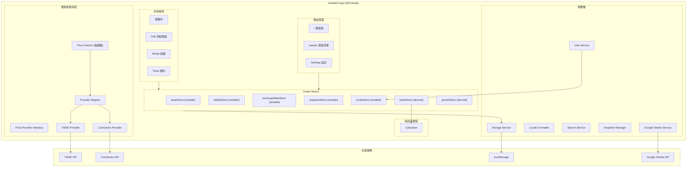
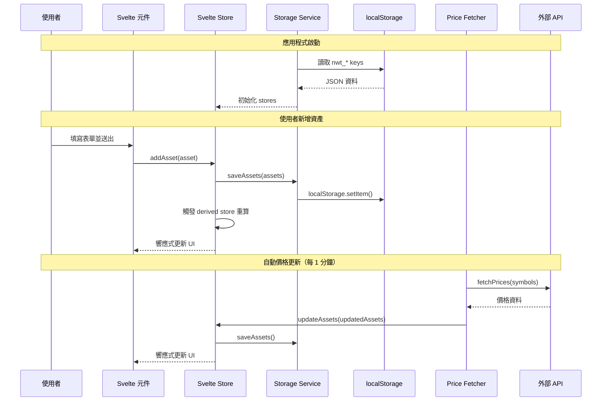

# 設計文件：SvelteKit SPA 遷移

## 概述

本設計文件描述將 Net Worth Tracker（個人淨資產追蹤器）從原生 JavaScript 無框架架構遷移至 SvelteKit 框架的技術方案。遷移後的應用程式以 SPA（Single Page Application）模式運行，使用 `@sveltejs/adapter-static` 產生純靜態檔案，不使用 SSR。

### 設計目標

1. **功能完整保留**：所有現有功能（資產/負債管理、即時價格、圖表、快照、Google Sheets 整合、PWA）在遷移後完全保留
2. **資料向後相容**：使用相同的 localStorage key（`nwt_` 前綴），現有使用者無需遷移資料
3. **架構現代化**：利用 Svelte 的響應式系統取代手動 DOM 操作與 Observer Pattern
4. **Price Provider 抽象化**：以介面模式（Interface Pattern）重構價格抓取，實現開放封閉原則
5. **國際化支援**：新增 i18n 多語言系統，支援 zh-TW、zh-CN、ja、en、ko 五種語言
6. **可測試性**：純函式模組（Calculator、Storage）與 UI 完全分離，便於 Vitest + fast-check 測試

### 技術決策與理由

| 決策 | 選擇 | 理由 |
|------|------|------|
| 框架 | SvelteKit | 編譯時優化、內建路由、極小 bundle size、響應式語法簡潔 |
| 建置適配器 | adapter-static | 純前端 SPA，不需要伺服器，可部署至任何靜態託管 |
| 狀態管理 | Svelte writable/derived store | 原生支援、無需額外套件、與 Svelte 響應式系統深度整合 |
| 測試框架 | Vitest + fast-check | 延續現有測試基礎設施，Vitest 與 Vite 原生整合 |
| 圖表 | Chart.js 4.x（npm 安裝） | 延續現有圖表實作，改為 npm 套件管理取代 CDN |
| i18n | 自建輕量 i18n store | 需求簡單（5 語言、純前端），無需引入 i18next 等重量級套件 |
| CSS | 全域 CSS + Svelte scoped style | 保留現有 CSS 自訂屬性系統，元件內樣式使用 Svelte scoped |

## 架構

### 整體架構圖



### 專案目錄結構

```
net-worth-tracker/
├── svelte.config.js              # SvelteKit 配置（adapter-static, SPA mode）
├── vite.config.js                # Vite 配置（含 Vitest）
├── package.json                  # 依賴與腳本
├── tsconfig.json                 # TypeScript/JSDoc 型別支援（可選）
├── static/
│   ├── manifest.json             # PWA manifest
│   ├── sw.js                     # Service Worker
│   └── icons/
│       ├── icon-192.png
│       └── icon-512.png
├── src/
│   ├── app.html                  # HTML 模板（lang="zh-TW"）
│   ├── app.css                   # 全域 CSS（從現有 style.css 遷移）
│   ├── lib/
│   │   ├── stores/
│   │   │   ├── assets.js         # 資產 writable store + CRUD
│   │   │   ├── liabilities.js    # 負債 writable store + CRUD
│   │   │   ├── exchangeRate.js   # 匯率 writable store
│   │   │   ├── snapshots.js      # 快照 writable store
│   │   │   ├── derived.js        # derived stores（totals, growth, pieData）
│   │   │   └── locale.js         # 語言 writable store
│   │   ├── services/
│   │   │   ├── storage.js        # localStorage 封裝（nwt_ 前綴）
│   │   │   ├── i18n.js           # i18n 核心（t 函式、語言切換）
│   │   │   ├── localeFormatter.js # 數字/日期本地化格式化
│   │   │   ├── searchService.js  # 台股/加密貨幣搜尋
│   │   │   ├── snapshotManager.js # 快照管理
│   │   │   └── googleSheets.js   # Google Sheets 整合
│   │   ├── price/
│   │   │   ├── interface.js      # Price Provider Interface 定義
│   │   │   ├── registry.js       # Provider Registry
│   │   │   ├── twseProvider.js   # TWSE 價格提供者
│   │   │   ├── coinGeckoProvider.js # CoinGecko 價格提供者
│   │   │   └── priceFetcher.js   # 價格抓取協調層
│   │   ├── utils/
│   │   │   └── calculator.js     # 純函式計算模組
│   │   └── i18n/
│   │       ├── zh-TW.json        # 繁體中文翻譯
│   │       ├── zh-CN.json        # 簡體中文翻譯
│   │       ├── ja.json           # 日文翻譯
│   │       ├── en.json           # 英文翻譯
│   │       └── ko.json           # 韓文翻譯
│   ├── routes/
│   │   ├── +layout.svelte        # 共用佈局（NavBar, FAB, Modal, Toast）
│   │   ├── +layout.js            # export const ssr = false; prerender = false
│   │   ├── +page.svelte          # 儀表板頁面
│   │   ├── assets/
│   │   │   └── +page.svelte      # 資產清單頁面
│   │   └── settings/
│   │       └── +page.svelte      # 設定頁面
│   └── components/
│       ├── NavBar.svelte         # 導覽列
│       ├── FAB.svelte            # 浮動操作按鈕
│       ├── Toast.svelte          # Toast 通知
│       ├── ConfirmDialog.svelte  # 確認對話框
│       ├── dashboard/
│       │   ├── QuickStats.svelte # 四格快速數字卡片
│       │   ├── PieChart.svelte   # 圓餅圖（Chart.js）
│       │   └── TrendChart.svelte # 趨勢折線圖（Chart.js）
│       ├── assets/
│       │   ├── AssetList.svelte  # 資產清單
│       │   ├── LiabilityList.svelte # 負債清單
│       │   ├── AssetItem.svelte  # 單一資產項目
│       │   └── LiabilityItem.svelte # 單一負債項目
│       ├── modals/
│       │   ├── AssetModal.svelte # 新增/編輯資產 Modal
│       │   ├── LiabilityModal.svelte # 新增/編輯負債 Modal
│       │   ├── SearchDropdown.svelte # 搜尋下拉選單
│       │   └── SummaryPanel.svelte   # 股票/加密貨幣摘要面板
│       └── settings/
│           ├── ExchangeRateSection.svelte  # 匯率設定
│           ├── DataManagement.svelte       # 資料匯出/匯入
│           ├── DiagnosticTools.svelte      # 診斷工具
│           ├── LanguageSelector.svelte     # 語言選擇器
│           └── GoogleIntegration.svelte    # Google 整合
└── tests/
    ├── calculator.test.js        # Calculator 屬性測試 + 單元測試
    ├── storage.test.js           # Storage round-trip 測試
    ├── snapshot.test.js          # Snapshot 冪等性測試
    ├── i18n.test.js              # i18n 翻譯完整性測試
    └── priceInterface.test.js    # Price Provider 介面合約測試
```

### 資料流




## 元件與介面

### 1. SvelteKit 配置

**svelte.config.js**
```javascript
import adapter from '@sveltejs/adapter-static';

export default {
  kit: {
    adapter: adapter({
      fallback: 'index.html'  // SPA fallback
    })
  }
};
```

**src/routes/+layout.js**
```javascript
export const ssr = false;
export const prerender = false;
```

### 2. Svelte Stores（狀態管理）

#### 2.1 資產 Store (`src/lib/stores/assets.js`)

```javascript
import { writable } from 'svelte/store';
import { loadAssets, saveAssets } from '$lib/services/storage.js';

function createAssetStore() {
  const { subscribe, set, update } = writable(loadAssets());

  return {
    subscribe,
    addAsset(asset) {
      update(assets => {
        const updated = [...assets, asset];
        saveAssets(updated);
        return updated;
      });
    },
    updateAsset(id, changes) {
      update(assets => {
        const updated = assets.map(a => a.id === id ? { ...a, ...changes } : a);
        saveAssets(updated);
        return updated;
      });
    },
    removeAsset(id) {
      update(assets => {
        const updated = assets.filter(a => a.id !== id);
        saveAssets(updated);
        return updated;
      });
    },
    replaceAll(newAssets) {
      set(newAssets);
      saveAssets(newAssets);
    }
  };
}

export const assets = createAssetStore();
```

#### 2.2 Derived Stores (`src/lib/stores/derived.js`)

```javascript
import { derived } from 'svelte/store';
import { assets } from './assets.js';
import { liabilities } from './liabilities.js';
import { exchangeRate } from './exchangeRate.js';
import { snapshots } from './snapshots.js';
import { calculateTotals, calculateGrowthRates, calculatePieChartData } from '$lib/utils/calculator.js';

export const totals = derived(
  [assets, liabilities, exchangeRate],
  ([$assets, $liabilities, $rate]) => calculateTotals($assets, $liabilities, $rate)
);

export const growthRates = derived(
  snapshots,
  ($snapshots) => calculateGrowthRates($snapshots)
);

export const pieChartData = derived(
  totals,
  ($totals) => calculatePieChartData($totals)
);
```

### 3. Price Provider Interface 架構

#### 3.1 介面定義 (`src/lib/price/interface.js`)

```javascript
/**
 * Price Provider Interface — 定義所有價格提供者必須實作的合約。
 *
 * 設計理念：類似 C# 的 interface，以 JavaScript class 定義抽象方法，
 * 具體實作者繼承此 class 並覆寫所有方法。
 */
export class PriceProviderInterface {
  /**
   * 批次抓取價格。
   * @param {string[]} symbols - 資產代號陣列
   * @returns {Promise<Map<string, PriceResult>>}
   */
  async fetchPrices(symbols) {
    throw new Error('fetchPrices() must be implemented');
  }

  /**
   * 回傳此提供者對應的資產類型。
   * @returns {string} 例如 'tw_stock' 或 'crypto'
   */
  getProviderType() {
    throw new Error('getProviderType() must be implemented');
  }

  /**
   * 回傳提供者名稱。
   * @returns {string}
   */
  getName() {
    throw new Error('getName() must be implemented');
  }

  /**
   * 檢查提供者是否可用。
   * @returns {Promise<boolean>}
   */
  async isAvailable() {
    throw new Error('isAvailable() must be implemented');
  }
}

/**
 * @typedef {Object} PriceResult
 * @property {number} price - 價格
 * @property {string} currency - 幣別（'TWD' | 'USD'）
 * @property {string} timestamp - ISO 時間戳
 */
```

#### 3.2 Provider Registry (`src/lib/price/registry.js`)

```javascript
const REQUIRED_METHODS = ['fetchPrices', 'getProviderType', 'getName', 'isAvailable'];

class PriceProviderRegistry {
  constructor() {
    /** @type {Map<string, PriceProviderInterface>} */
    this.providers = new Map();
  }

  register(provider) {
    // 驗證介面合約
    for (const method of REQUIRED_METHODS) {
      if (typeof provider[method] !== 'function') {
        throw new Error(
          `Provider "${provider.constructor.name}" 缺少必要方法: ${method}`
        );
      }
    }
    this.providers.set(provider.getProviderType(), provider);
  }

  getProviderByType(assetType) {
    return this.providers.get(assetType) || null;
  }

  getAllProviders() {
    return Array.from(this.providers.values());
  }
}

export const registry = new PriceProviderRegistry();
```

#### 3.3 TWSE Provider (`src/lib/price/twseProvider.js`)

```javascript
import { PriceProviderInterface } from './interface.js';

export class TWSEPriceProvider extends PriceProviderInterface {
  getProviderType() { return 'tw_stock'; }
  getName() { return 'TWSE'; }

  async isAvailable() {
    try {
      const res = await fetch('https://mis.twse.com.tw/stock/api/getStockInfo.jsp?ex_ch=tse_2330.tw&json=1&delay=0');
      return res.ok;
    } catch { return false; }
  }

  async fetchPrices(symbols) {
    const results = new Map();
    for (const symbol of symbols) {
      const price = await this._fetchSingle(symbol);
      if (price !== null) {
        results.set(symbol, {
          price,
          currency: 'TWD',
          timestamp: new Date().toISOString()
        });
      }
    }
    return results;
  }

  async _fetchSingle(symbol) {
    for (const market of ['tse', 'otc']) {
      try {
        const url = `https://mis.twse.com.tw/stock/api/getStockInfo.jsp?ex_ch=${market}_${encodeURIComponent(symbol)}.tw&json=1&delay=0`;
        const res = await fetch(url);
        if (!res.ok) continue;
        const data = await res.json();
        const info = data?.msgArray?.[0];
        if (!info) continue;
        const price = parseFloat(info.z) || parseFloat(info.y) || null;
        if (price && price > 0) return price;
      } catch { continue; }
    }
    return null;
  }
}
```

#### 3.4 CoinGecko Provider (`src/lib/price/coinGeckoProvider.js`)

```javascript
import { PriceProviderInterface } from './interface.js';

const CRYPTO_ID_MAP = {
  'BTC': 'bitcoin', 'ETH': 'ethereum', 'USDT': 'tether',
  'USDC': 'usd-coin', 'BNB': 'binancecoin', 'SOL': 'solana',
  'XRP': 'ripple', 'ADA': 'cardano', 'AVAX': 'avalanche-2',
  'DOGE': 'dogecoin', 'DOT': 'polkadot', 'LINK': 'chainlink',
  'MATIC': 'matic-network', 'UNI': 'uniswap', 'LTC': 'litecoin',
  'DAI': 'dai', 'SHIB': 'shiba-inu', 'TRX': 'tron',
  'XLM': 'stellar', 'XMR': 'monero',
};

export class CoinGeckoPriceProvider extends PriceProviderInterface {
  getProviderType() { return 'crypto'; }
  getName() { return 'CoinGecko'; }

  async isAvailable() {
    try {
      const res = await fetch('https://api.coingecko.com/api/v3/ping');
      return res.ok;
    } catch { return false; }
  }

  async fetchPrices(symbols) {
    const results = new Map();
    const coinIds = symbols
      .map(s => CRYPTO_ID_MAP[s.toUpperCase()])
      .filter(Boolean);

    if (coinIds.length === 0) return results;

    try {
      const url = `https://api.coingecko.com/api/v3/simple/price?ids=${coinIds.join(',')}&vs_currencies=twd`;
      const res = await fetch(url);
      if (!res.ok) return results;
      const data = await res.json();

      for (const symbol of symbols) {
        const coinId = CRYPTO_ID_MAP[symbol.toUpperCase()];
        if (coinId && data[coinId]?.twd) {
          results.set(symbol, {
            price: data[coinId].twd,
            currency: 'TWD',
            timestamp: new Date().toISOString()
          });
        }
      }
    } catch { /* 靜默失敗 */ }

    return results;
  }
}
```

#### 3.5 Price Fetcher 協調層 (`src/lib/price/priceFetcher.js`)

```javascript
import { registry } from './registry.js';

const backoffState = new Map();
const MAX_BACKOFF_MS = 5 * 60 * 1000;

export async function fetchAllPrices(assets) {
  // 依 type 分組並去重
  const grouped = new Map(); // type -> Set<symbol>
  for (const asset of assets) {
    if (!asset.symbol) continue;
    if (!grouped.has(asset.type)) grouped.set(asset.type, new Set());
    grouped.get(asset.type).add(asset.symbol);
  }

  // 透過 Registry 取得對應 Provider 並抓取
  const priceCache = new Map(); // `${type}_${symbol}` -> price
  for (const [type, symbols] of grouped) {
    const provider = registry.getProviderByType(type);
    if (!provider) continue;

    const key = `provider_${type}`;
    if (!canRetry(key)) continue;

    try {
      const results = await provider.fetchPrices([...symbols]);
      for (const [symbol, result] of results) {
        priceCache.set(`${type}_${symbol}`, result.price);
      }
      recordSuccess(key);
    } catch {
      recordFailure(key);
    }
  }

  // 套用價格至資產
  return assets.map(asset => {
    if (!asset.symbol) return { ...asset };
    const price = priceCache.get(`${asset.type}_${asset.symbol}`);
    if (price != null) {
      return {
        ...asset,
        pricePerUnit: price,
        priceSource: 'auto',
        lastPriceUpdate: new Date().toISOString()
      };
    }
    return { ...asset };
  });
}

// 指數退避（與現有邏輯相同）
function canRetry(key) { /* ... */ }
function recordSuccess(key) { backoffState.delete(key); }
function recordFailure(key) { /* 前 3 次不退避，之後 2^n 遞增，最大 5 分鐘 */ }
```

### 4. I18n 國際化系統

#### 4.1 I18n Service (`src/lib/services/i18n.js`)

```javascript
import { writable, derived } from 'svelte/store';
import zhTW from '$lib/i18n/zh-TW.json';
import zhCN from '$lib/i18n/zh-CN.json';
import ja from '$lib/i18n/ja.json';
import en from '$lib/i18n/en.json';
import ko from '$lib/i18n/ko.json';

const TRANSLATIONS = { 'zh-TW': zhTW, 'zh-CN': zhCN, ja, en, ko };
const STORAGE_KEY = 'nwt_locale';
const DEFAULT_LOCALE = 'zh-TW';

function getInitialLocale() {
  if (typeof localStorage !== 'undefined') {
    return localStorage.getItem(STORAGE_KEY) || DEFAULT_LOCALE;
  }
  return DEFAULT_LOCALE;
}

export const locale = writable(getInitialLocale());

// 語言切換時持久化並更新 <html lang>
locale.subscribe(($locale) => {
  if (typeof localStorage !== 'undefined') {
    localStorage.setItem(STORAGE_KEY, $locale);
  }
  if (typeof document !== 'undefined') {
    document.documentElement.lang = $locale;
  }
});

/**
 * 翻譯函式 — 支援插值參數。
 * @param {string} key - 翻譯鍵（支援巢狀，如 'nav.dashboard'）
 * @param {Record<string, string|number>} [params] - 插值參數
 * @returns {string}
 */
export function t(key, params = {}) {
  let currentLocale;
  locale.subscribe(v => currentLocale = v)();

  let value = getNestedValue(TRANSLATIONS[currentLocale], key);

  // 回退至 zh-TW
  if (value === undefined) {
    value = getNestedValue(TRANSLATIONS[DEFAULT_LOCALE], key);
  }

  // 若仍找不到，回傳 key 本身
  if (value === undefined) return key;

  // 插值替換
  return value.replace(/\{(\w+)\}/g, (_, k) =>
    params[k] !== undefined ? String(params[k]) : `{${k}}`
  );
}

// 響應式翻譯 store（用於 Svelte 模板中的 $t）
export const tStore = derived(locale, () => t);

function getNestedValue(obj, path) {
  return path.split('.').reduce((o, k) => o?.[k], obj);
}
```

#### 4.2 翻譯檔案結構範例

**zh-TW.json（繁體中文，預設語言）**
```json
{
  "nav": {
    "dashboard": "儀表板",
    "assets": "資產",
    "settings": "設定"
  },
  "dashboard": {
    "monthlyGrowth": "資產月增率",
    "investmentTotal": "投資總額",
    "netWorth": "淨資產",
    "liabilities": "債務",
    "assetAllocation": "資產配置",
    "assetTrend": "資產趨勢",
    "noData": "尚無資料"
  },
  "common": {
    "save": "儲存",
    "cancel": "取消",
    "delete": "刪除",
    "edit": "編輯",
    "add": "新增",
    "confirm": "確認"
  },
  "toast": {
    "rateUpdated": "匯率已更新",
    "dataExported": "資料已匯出",
    "dataImported": "資料已匯入",
    "priceUpdated": "已更新 {count} 個資產的價格",
    "cacheCleared": "快取已清除"
  }
}
```

**zh-CN.json（簡體中文，獨立撰寫）**
```json
{
  "nav": {
    "dashboard": "仪表盘",
    "assets": "资产",
    "settings": "设置"
  },
  "dashboard": {
    "monthlyGrowth": "资产月增长率",
    "investmentTotal": "投资总额",
    "netWorth": "净资产",
    "liabilities": "负债",
    "assetAllocation": "资产配置",
    "assetTrend": "资产趋势",
    "noData": "暂无数据"
  },
  "common": {
    "save": "保存",
    "cancel": "取消",
    "delete": "删除",
    "edit": "编辑",
    "add": "添加",
    "confirm": "确认"
  },
  "toast": {
    "rateUpdated": "汇率已更新",
    "dataExported": "数据已导出",
    "dataImported": "数据已导入",
    "priceUpdated": "已更新 {count} 个资产的价格",
    "cacheCleared": "缓存已清除"
  }
}
```

#### 4.3 Locale Formatter (`src/lib/services/localeFormatter.js`)

```javascript
import { locale } from './i18n.js';

let currentLocale = 'zh-TW';
locale.subscribe(v => currentLocale = v);

export function formatCurrency(amount, currency = 'TWD') {
  return new Intl.NumberFormat(currentLocale, {
    style: 'currency',
    currency,
    minimumFractionDigits: 0,
    maximumFractionDigits: 0
  }).format(amount);
}

export function formatPercent(value) {
  return new Intl.NumberFormat(currentLocale, {
    style: 'percent',
    minimumFractionDigits: 2,
    maximumFractionDigits: 2
  }).format(value / 100);
}

export function formatDate(dateStr) {
  return new Intl.DateTimeFormat(currentLocale, {
    year: 'numeric',
    month: '2-digit',
    day: '2-digit'
  }).format(new Date(dateStr));
}
```

### 5. Storage Service（向後相容）

```javascript
const KEYS = {
  ASSETS: 'nwt_assets',
  LIABILITIES: 'nwt_liabilities',
  EXCHANGE_RATE: 'nwt_exchange_rate',
  SNAPSHOTS: 'nwt_snapshots',
};

// 介面與現有 storage.js 完全相同，確保 localStorage key 向後相容
export function loadAssets() { return readItem(KEYS.ASSETS, []); }
export function saveAssets(assets) { writeItem(KEYS.ASSETS, assets); }
// ... 其餘函式同現有實作
```

### 6. 元件介面摘要

| 元件 | Props / 事件 | 職責 |
|------|-------------|------|
| `+layout.svelte` | — | 包含 NavBar、FAB、Modal 容器、Toast、初始化 stores |
| `NavBar.svelte` | — | 導覽列，使用 `$page.url.pathname` 高亮當前頁籤 |
| `QuickStats.svelte` | `{totals, growthRates}` | 四格快速數字卡片 |
| `PieChart.svelte` | `{pieData, totals, breakdown}` | Chart.js Doughnut 圖 + 圖例 |
| `TrendChart.svelte` | `{snapshots}` | Chart.js 折線圖 + 時間範圍篩選 |
| `AssetModal.svelte` | `{asset?, onClose}` | 新增/編輯資產表單 + 搜尋 + 摘要 |
| `LiabilityModal.svelte` | `{liability?, onClose}` | 新增/編輯負債表單 + 還款明細 |
| `Toast.svelte` | `{message, type, duration}` | 全域 Toast 通知 |
| `LanguageSelector.svelte` | — | 語言下拉選擇器 |


## 資料模型

### Asset（資產）

```javascript
/**
 * @typedef {Object} Asset
 * @property {string} id - UUID
 * @property {string} name - 資產名稱（如「台積電」）
 * @property {string} symbol - 代號（如「2330」、「BTC」）
 * @property {'investment' | 'liquid'} category - 分類
 * @property {'tw_stock' | 'crypto' | 'cash' | 'other'} type - 類型
 * @property {number} quantity - 持有數量
 * @property {'TWD' | 'USD'} currency - 計價幣別
 * @property {number} pricePerUnit - 每單位價格
 * @property {'manual' | 'auto'} priceSource - 價格來源
 * @property {string | null} lastPriceUpdate - ISO 時間戳
 */
```

### Liability（負債）

```javascript
/**
 * @typedef {Object} Liability
 * @property {string} id - UUID
 * @property {string} name - 負債名稱
 * @property {'credit' | 'home_loan' | 'pledge' | 'mortgage' | 'other'} category - 分類
 * @property {number} amount - 金額（TWD 或 USD）
 * @property {'TWD' | 'USD'} currency - 計價幣別
 * @property {number} [interestRate] - 年利率（%）
 * @property {number} [terms] - 期數（月）
 * @property {string} [startDate] - 起始日期（YYYY-MM-DD）
 * @property {string} [endDate] - 結束日期（YYYY-MM-DD）
 * @property {number} [creditLine] - 核准額度
 * @property {string} [drawdownDate] - 動用日期
 */
```

### Snapshot（快照）

```javascript
/**
 * @typedef {Object} Snapshot
 * @property {string} date - 日期（YYYY-MM-DD）
 * @property {number} netWorth - 淨資產（TWD）
 */
```

### AppState（應用程式狀態）

```javascript
/**
 * @typedef {Object} AppState
 * @property {Asset[]} assets - 資產陣列
 * @property {Liability[]} liabilities - 負債陣列
 * @property {number} exchangeRate - USD/TWD 匯率
 * @property {Snapshot[]} snapshots - 快照陣列
 */
```

### PriceResult（價格結果）

```javascript
/**
 * @typedef {Object} PriceResult
 * @property {number} price - 價格
 * @property {string} currency - 幣別
 * @property {string} timestamp - ISO 時間戳
 */
```

### localStorage Key 對照表

| Key | 型別 | 說明 | 預設值 |
|-----|------|------|--------|
| `nwt_assets` | `Asset[]` | 資產陣列 | `[]` |
| `nwt_liabilities` | `Liability[]` | 負債陣列 | `[]` |
| `nwt_exchange_rate` | `number` | USD/TWD 匯率 | `31.5` |
| `nwt_snapshots` | `Snapshot[]` | 快照陣列 | `[]` |
| `nwt_locale` | `string` | 語言代碼 | `'zh-TW'` |

所有 key 與現有應用程式完全相同（`nwt_locale` 為新增），確保資料向後相容。


## 正確性屬性

*屬性（Property）是一個在系統所有有效執行中都應成立的特徵或行為——本質上是對系統應做什麼的形式化陳述。屬性是人類可讀規格與機器可驗證正確性保證之間的橋樑。*

### Property 1: 資料匯出/匯入 Round-Trip

*For any* 有效的 AppState 物件（包含任意資產陣列、負債陣列、正數匯率、快照陣列），將其透過 `exportData` 序列化為 JSON 字串後，再透過 `importData` 反序列化，應產生與原始物件深度相等的結果。

**Validates: Requirements 4.7, 4.2, 4.4**

### Property 2: 匯入驗證拒絕缺失欄位

*For any* 有效的 AppState 物件，移除其中任一必要欄位（`assets`、`liabilities`、`exchangeRate`、`snapshots`）後，呼叫 `importData` 應拋出錯誤，且錯誤訊息中包含該缺失欄位的名稱。

**Validates: Requirements 4.5, 4.6**

### Property 3: 淨資產不變量

*For any* 有效的資產陣列、負債陣列與正數匯率，`calculateTotals` 計算出的 `netWorth` 應等於 `totalAssets - totalLiabilities`。

**Validates: Requirements 15.4, 15.7**

### Property 4: TWD 轉換正數不變量

*For any* 正數的數量（quantity）、正數的每單位價格（pricePerUnit）與正數的匯率（exchangeRate），`calculateAssetTWD` 計算出的 TWD 值應為正數。

**Validates: Requirements 15.2, 15.8**

### Property 5: 貸款還本加總等於本金

*For any* 有效的貸款參數（正數本金、非負利率、正整數期數），無論使用等額本息（`calculateLoanSchedule`）或本金平均攤還（`calculateEqualPrincipalSchedule`），所有期數的 `principalPart` 加總應等於原始本金。

**Validates: Requirements 16.1, 16.2, 16.4**

### Property 6: 貸款最終餘額為零

*For any* 有效的貸款參數（正數本金、非負利率、正整數期數），無論使用等額本息或本金平均攤還，最後一期的 `remainingBalance` 應為零。

**Validates: Requirements 16.3, 16.5**

### Property 7: 快照冪等性

*For any* 資產陣列、負債陣列、匯率與快照陣列，對同一天重複呼叫 `autoSnapshot` 不應增加快照數量——第二次呼叫後的快照陣列長度應與第一次呼叫後相同。

**Validates: Requirements 9.2, 19.5**

### Property 8: 快照數量上限

*For any* 長度超過 365 的快照陣列，呼叫 `autoSnapshot` 後，回傳的快照陣列長度應不超過 365。

**Validates: Requirements 9.3**

### Property 9: 快照時間範圍篩選

*For any* 快照陣列與時間範圍（1w/1m/6m/1y），`filterSnapshotsByRange` 回傳的所有快照日期應在指定範圍的截止日期之後（含）。

**Validates: Requirements 9.7**

### Property 10: Provider Registry 合約驗證

*For any* 物件，若該物件缺少 `fetchPrices`、`getProviderType`、`getName`、`isAvailable` 中的任一方法，呼叫 `registry.register()` 應拋出錯誤，且錯誤訊息包含缺失的方法名稱。

**Validates: Requirements 8.7**

### Property 11: Price Fetcher 去重

*For any* 資產陣列（可能包含相同 symbol + type 的重複項目），Price Fetcher 對每個唯一的 (type, symbol) 組合應只呼叫一次 Provider 的 `fetchPrices`。

**Validates: Requirements 8.13**

### Property 12: Price Fetcher 多型路由

*For any* 已註冊至 Registry 的 Provider 集合，Price Fetcher 應根據資產的 `type` 欄位將請求路由至對應的 Provider，而非硬編碼特定實作。

**Validates: Requirements 8.12, 8.19, 8.20**

### Property 13: 翻譯完整性不變量

*For all* 支援的語言（zh-CN、ja、en、ko），其 Translation_File 應包含與 zh-TW 翻譯檔完全相同的所有翻譯鍵集合。

**Validates: Requirements 22.5, 22.19**

### Property 14: 翻譯插值參數一致性

*For all* 在 zh-TW 翻譯檔中包含 `{param}` 佔位符的翻譯鍵，每種其他語言的對應翻譯值應包含完全相同的參數佔位符集合。

**Validates: Requirements 22.20**

### Property 15: 語言切換 Round-Trip

*For any* 有效的翻譯鍵與任意兩種支援語言 A 和 B，從語言 A 切換至 B 再切回 A 後，`t(key)` 應回傳與切換前相同的翻譯字串。

**Validates: Requirements 22.21**

### Property 16: 語言持久化 Round-Trip

*For any* 支援的語言代碼，將其設定為當前語言後，該語言代碼應被儲存至 localStorage（key 為 `nwt_locale`）；重新初始化 I18n Service 後，當前語言應與儲存的語言代碼一致。

**Validates: Requirements 22.12a, 22.13a**

### Property 17: 翻譯回退機制

*For any* 在非預設語言中不存在但在 zh-TW 中存在的翻譯鍵，`t(key)` 應回傳 zh-TW 的對應翻譯值而非 undefined。

**Validates: Requirements 22.8**

### Property 18: 輸入驗證函式正確性

*For any* 有限正數，`validateQuantity`、`validatePrice`、`validateAmount`、`validateExchangeRate` 應回傳 `true`；*For any* 非正數（零、負數、NaN、Infinity），應回傳 `false`。

**Validates: Requirements 15.5**

### Property 19: 圓餅圖百分比加總

*For any* 有效的 totals 物件（所有值非負），`calculatePieChartData` 計算出的百分比陣列加總應約等於 100%（容差 0.1%），或當所有值為零時百分比全為 0。

**Validates: Requirements 15.6**


## 錯誤處理

### 1. localStorage 錯誤

| 情境 | 處理方式 |
|------|---------|
| `localStorage.setItem` 拋出異常（容量已滿） | `Storage_Service` 拋出 `Error`，訊息包含 key 名稱與原始錯誤 |
| `localStorage.getItem` 回傳 `null` | 回傳預設值（空陣列或預設匯率 31.5） |
| `JSON.parse` 失敗（資料損壞） | 回傳預設值，不拋出錯誤 |

### 2. 資料匯入錯誤

| 情境 | 處理方式 |
|------|---------|
| JSON 格式無效 | 拋出 `Error('匯入失敗：JSON 格式無效')` |
| 缺少必要欄位 | 拋出 `Error('匯入失敗：缺少必要欄位「{fieldName}」')` |
| `assets` 不是陣列 | 拋出 `Error('匯入失敗：assets 必須為陣列')` |
| `exchangeRate` 不是數字 | 拋出 `Error('匯入失敗：exchangeRate 必須為數字')` |

### 3. 價格抓取錯誤

| 情境 | 處理方式 |
|------|---------|
| API 請求失敗（網路錯誤） | 靜默失敗，保留原有價格，記錄退避狀態 |
| API 回傳非預期格式 | 靜默失敗，保留原有價格 |
| CORS 阻擋 | 自動透過 `corsproxy.io` 代理重試 |
| 連續失敗超過 3 次 | 啟動指數退避（2^n 秒，最大 5 分鐘） |

### 4. Provider Registry 錯誤

| 情境 | 處理方式 |
|------|---------|
| 註冊的 Provider 缺少必要方法 | 拋出 `Error`，訊息包含缺失的方法名稱 |
| 查詢不存在的 Provider 類型 | 回傳 `null`，Price Fetcher 跳過該類型 |

### 5. I18n 錯誤

| 情境 | 處理方式 |
|------|---------|
| 翻譯鍵在當前語言不存在 | 回退至 zh-TW 的對應翻譯 |
| 翻譯鍵在 zh-TW 也不存在 | 回傳翻譯鍵本身作為顯示文字 |
| 插值參數未提供 | 保留原始佔位符 `{paramName}` |

### 6. 表單驗證錯誤

| 情境 | 處理方式 |
|------|---------|
| 資產名稱為空 | 顯示欄位錯誤「請輸入資產名稱」 |
| 數量不是正數 | 顯示欄位錯誤「數量必須為正數」 |
| 價格不是正數 | 顯示欄位錯誤「每單位價格必須為正數」 |
| 匯率不是正數 | 顯示欄位錯誤「匯率必須為正數」 |

### 7. Google Sheets 錯誤

| 情境 | 處理方式 |
|------|---------|
| Google API 未初始化 | 顯示 Toast 錯誤「請先完成 Google API 設置」 |
| 登入失敗 | 顯示 Toast 錯誤「登入失敗，請重試」 |
| 同步失敗 | 顯示 Toast 錯誤「同步失敗，請重試」 |

## 測試策略

### 測試框架與工具

- **Vitest** 1.6+：測試執行器，配置 `jsdom` 環境
- **fast-check** 3.19+：屬性測試（Property-Based Testing）
- **@vitest/coverage-v8**：程式碼覆蓋率

### 雙軌測試方法

本專案採用**單元測試 + 屬性測試**的雙軌策略：

1. **屬性測試（Property-Based Tests）**：驗證跨所有輸入的通用屬性，每個屬性至少執行 100 次迭代
2. **單元測試（Example-Based Tests）**：驗證特定範例、邊界條件與錯誤情境

### 屬性測試配置

```javascript
// vitest.config.js
import { defineConfig } from 'vitest/config';
import { sveltekit } from '@sveltejs/kit/vite';

export default defineConfig({
  plugins: [sveltekit()],
  test: {
    environment: 'jsdom',
    include: ['tests/**/*.test.js', 'src/**/*.test.js'],
    coverage: {
      provider: 'v8',
      include: ['src/lib/**/*.js'],
      exclude: ['src/lib/i18n/**']
    }
  }
});
```

### 屬性測試清單

每個屬性測試必須：
- 執行至少 100 次迭代
- 以註解標記對應的設計文件屬性
- 標記格式：`Feature: sveltekit-spa-migration, Property {number}: {title}`

| 屬性 # | 標題 | 測試檔案 | 目標模組 |
|--------|------|---------|---------|
| 1 | 資料匯出/匯入 Round-Trip | `tests/storage.test.js` | Storage Service |
| 2 | 匯入驗證拒絕缺失欄位 | `tests/storage.test.js` | Storage Service |
| 3 | 淨資產不變量 | `tests/calculator.test.js` | Calculator |
| 4 | TWD 轉換正數不變量 | `tests/calculator.test.js` | Calculator |
| 5 | 貸款還本加總等於本金 | `tests/calculator.test.js` | Calculator |
| 6 | 貸款最終餘額為零 | `tests/calculator.test.js` | Calculator |
| 7 | 快照冪等性 | `tests/snapshot.test.js` | Snapshot Manager |
| 8 | 快照數量上限 | `tests/snapshot.test.js` | Snapshot Manager |
| 9 | 快照時間範圍篩選 | `tests/snapshot.test.js` | Snapshot Manager |
| 10 | Provider Registry 合約驗證 | `tests/priceInterface.test.js` | Price Provider Registry |
| 11 | Price Fetcher 去重 | `tests/priceInterface.test.js` | Price Fetcher |
| 12 | Price Fetcher 多型路由 | `tests/priceInterface.test.js` | Price Fetcher |
| 13 | 翻譯完整性不變量 | `tests/i18n.test.js` | I18n Service |
| 14 | 翻譯插值參數一致性 | `tests/i18n.test.js` | I18n Service |
| 15 | 語言切換 Round-Trip | `tests/i18n.test.js` | I18n Service |
| 16 | 語言持久化 Round-Trip | `tests/i18n.test.js` | I18n Service |
| 17 | 翻譯回退機制 | `tests/i18n.test.js` | I18n Service |
| 18 | 輸入驗證函式正確性 | `tests/calculator.test.js` | Calculator |
| 19 | 圓餅圖百分比加總 | `tests/calculator.test.js` | Calculator |

### 單元測試清單

| 測試檔案 | 測試項目 |
|---------|---------|
| `tests/calculator.test.js` | 特定資產 TWD 計算範例、零資產/零負債邊界、利率為零的貸款 |
| `tests/storage.test.js` | localStorage 寫入失敗處理、無效 JSON 匯入、空 localStorage 讀取 |
| `tests/snapshot.test.js` | 空快照陣列建立首筆快照、跨日快照新增 |
| `tests/i18n.test.js` | 預設語言為 zh-TW、不存在的 key 回傳 key 本身、zh-CN 使用大陸慣用詞彙 |
| `tests/priceInterface.test.js` | 註冊有效 Provider、查詢不存在的類型回傳 null |
| `tests/searchService.test.js` | 台股精確匹配優先、加密貨幣搜尋結果上限 10 筆 |

### 整合測試

| 測試項目 | 說明 |
|---------|------|
| TWSE API 回應解析 | 使用 mock 資料驗證 TWSE Provider 正確解析 API 回應 |
| CoinGecko API 回應解析 | 使用 mock 資料驗證 CoinGecko Provider 正確解析 API 回應 |
| Store → Storage 持久化 | 驗證 store 操作後 localStorage 包含正確資料 |
| 現有資料相容性 | 以現有格式的 mock 資料驗證新應用程式能正確載入 |

### 測試執行指令

```bash
# 執行所有測試（單次）
npm test

# 執行測試（監聽模式）
npm run test:watch

# 執行測試並產生覆蓋率報告
npm run coverage
```
